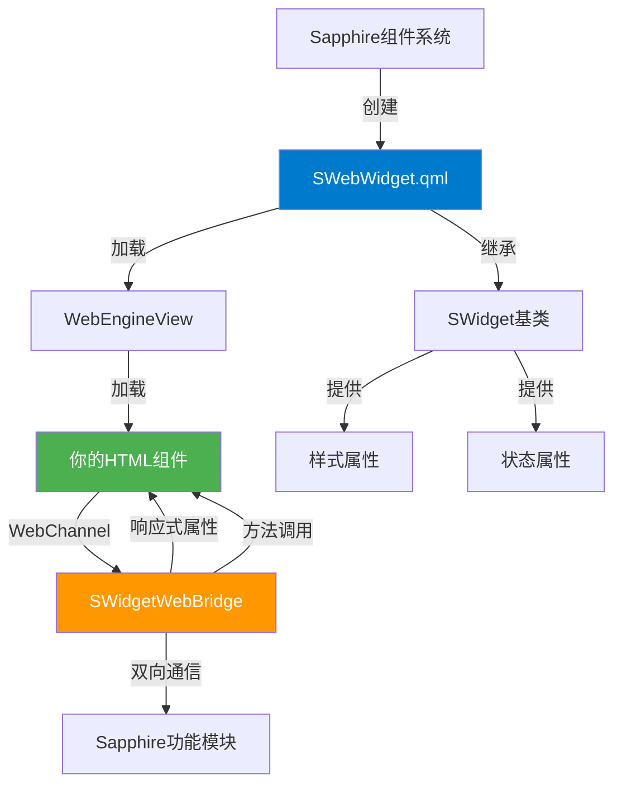
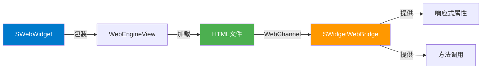
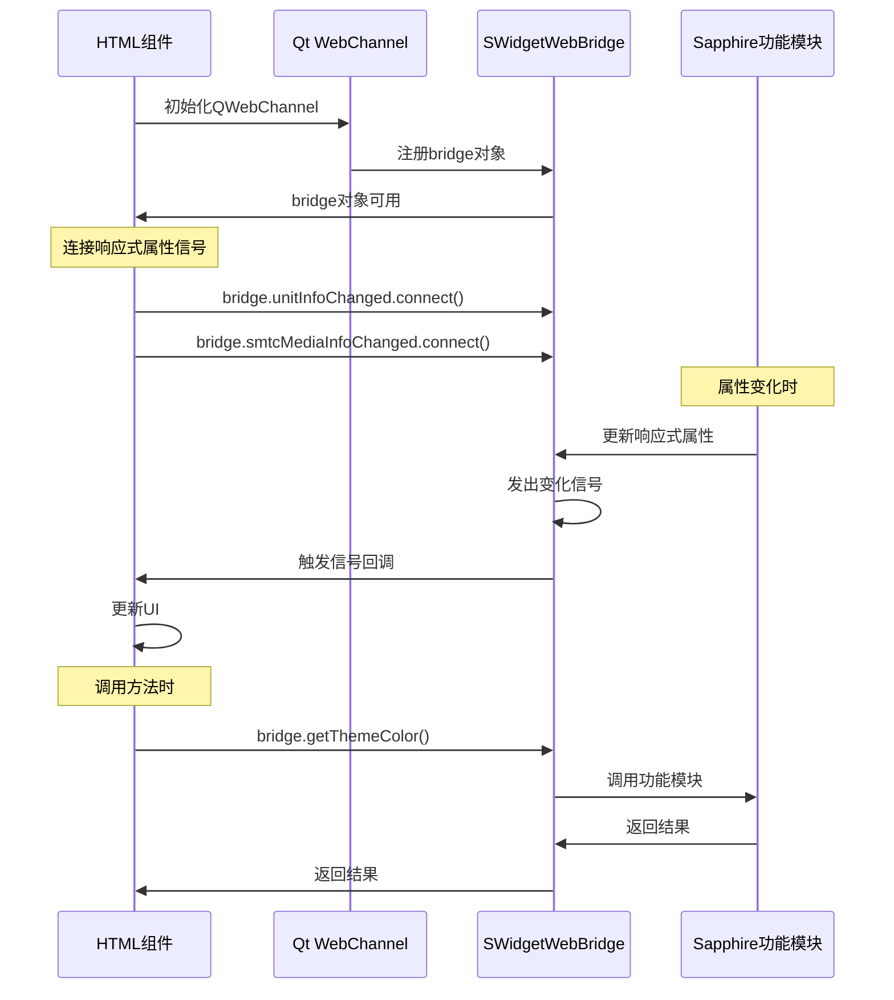
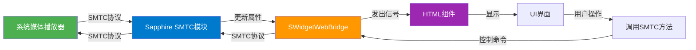
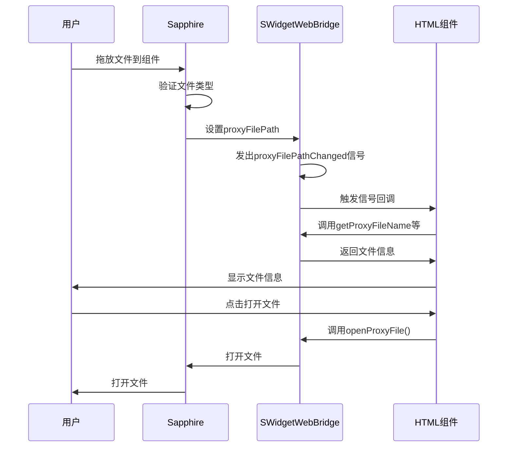

# HTML组件开发文档

## 概述

HTML组件是Sapphire桌面增强软件中的自定义小组件，使用HTML/JavaScript/CSS技术开发。本文档将指导你如何创建和开发HTML组件。

### 架构概览



## 快速开始

### 0. 环境配置

1. **HTML运行时环境**：HTML是解释性语言，在Sapphire中已经有运行时环境（WebEngine），无需额外编译
2. **开发环境推荐**：
   - 使用任意文本编辑器或IDE（VS Code、WebStorm等）
   - 直接在Sapphire中创建小组件实例，搭配热重载和软件内运行时、日志输出进行开发
3. **调试工具**：
   - **浏览器开发者工具**：在编辑模式下右键 → 开发者工具 → 调试面板
   - **在浏览器中打开**：在开发者模式下右键小组件，选择"在浏览器中打开"，可在系统默认浏览器中打开并调试（支持完整的浏览器开发者工具）
   - **控制台输出**：可以使用 `console.log()` 输出调试信息

### 1. 创建新组件

1. 打开小组件编辑器（通过主菜单或快捷键）
2. 点击"创建新小组件"按钮
3. 选择"从模板创建" → 选择"HTML模板"
4. 输入组件名称（name）和显示名称（displayName）
5. 点击确定，系统会自动创建新的HTML组件项目

### 2. 编辑组件

创建完成后，组件会自动在编辑器中打开：

- **主文件路径**：组件的主HTML文件会自动设置为相对路径，无需额外配置
- **文件结构**：新组件会创建在 `resources/swidget/` 目录下，包含：
  - `metadata.json` - 组件元数据文件
  - `组件名.html` - 主HTML文件

### 3. 打开组件文件

在编辑器中点击"打开文件"按钮，会使用系统默认程序打开HTML文件（通常是浏览器或代码编辑器）。

## 基本结构

### HTML文件结构

HTML组件是标准的HTML文件，通过 `SWebWidget.qml` 包装加载。基本结构如下：

```html
<!DOCTYPE html>
<html lang="zh-CN">
<head>
    <meta charset="UTF-8" />
    <meta name="viewport" content="width=device-width, initial-scale=1.0" />
    <title>我的小组件</title>
    
    <!-- 必需：引入Qt WebChannel库 -->
    <script src="qrc:///qtwebchannel/qwebchannel.js"></script>
    
    <style>
        /* 你的CSS样式 */
        body {
            width: 100vw;
            height: 100vh;
            margin: 0;
            padding: 0;
            background: transparent;
            overflow: hidden;
        }
    </style>
</head>
<body>
    <!-- 你的组件内容 -->
    <div id="content">
        <h1>Hello, HTML组件!</h1>
    </div>
    
    <script>
        // WebChannel初始化
        let bridge = null;
        
        // 初始化WebChannel
        function initWebChannel() {
            if (typeof qt === "undefined" || !qt.webChannelTransport) {
                console.error("错误: qt.webChannelTransport 不可用");
                return;
            }
            
            new QWebChannel(qt.webChannelTransport, function(channel) {
                bridge = channel.objects.bridge;
                
                if (!bridge) {
                    console.error("错误: bridge对象未找到");
                    return;
                }
                
                console.log("✅ WebChannel初始化成功");
                
                // 初始化完成后的操作
                init();
            });
        }
        
        // 初始化
        function init() {
            // 你的初始化代码
        }
        
        // 页面加载完成后初始化WebChannel
        window.addEventListener("DOMContentLoaded", function() {
            setTimeout(initWebChannel, 100);
        });
    </script>
</body>
</html>
```

### 组件结构图



## WebChannel通信

### 初始化WebChannel

HTML组件通过Qt WebChannel与Sapphire通信，必须引入WebChannel库并初始化：

```html
<!-- 1. 引入WebChannel库（必需） -->
<script src="qrc:///qtwebchannel/qwebchannel.js"></script>

<script>
    let bridge = null;
    
    function initWebChannel() {
        // 检查qt对象是否可用
        if (typeof qt === "undefined" || !qt.webChannelTransport) {
            console.error("错误: qt.webChannelTransport 不可用");
            return;
        }
        
        // 创建WebChannel连接
        new QWebChannel(qt.webChannelTransport, function(channel) {
            // 获取bridge对象
            bridge = channel.objects.bridge;
            
            if (!bridge) {
                console.error("错误: bridge对象未找到");
                return;
            }
            
            console.log("✅ WebChannel初始化成功");
            
            // 连接响应式属性变化信号
            connectReactiveProperties();
            
            // 初始化组件
            init();
        });
    }
    
    // 页面加载完成后初始化
    window.addEventListener("DOMContentLoaded", function() {
        // 延迟一下确保qt对象已准备好
        setTimeout(initWebChannel, 100);
    });
</script>
```

### WebChannel通信流程图



## Bridge对象

### Bridge对象概述

`bridge` 对象（`SWidgetWebBridge` 实例）是HTML组件与Sapphire通信的核心接口，提供：

- **响应式属性**：自动同步的属性，变化时通过信号通知
- **方法调用**：调用Sapphire功能的方法
- **信号连接**：连接属性变化信号

### 响应式属性

响应式属性是只读的，当值变化时会自动发出信号，HTML端可以连接信号来接收更新：

| 属性名 | 类型 | 说明 | 变化信号 |
|--------|------|------|----------|
| `smtcMediaInfo` | string | SMTC媒体信息（JSON字符串） | `smtcMediaInfoChanged` |
| `smtcPlaybackStatus` | string | SMTC播放状态（JSON字符串） | `smtcPlaybackStatusChanged` |
| `smtcControlCapabilities` | string | SMTC控制能力（JSON字符串） | `smtcControlCapabilitiesChanged` |
| `unitInfo` | string | 小组件基础信息（JSON字符串） | `unitInfoChanged` |
| `proxyFilePath` | string | 代理文件路径 | `proxyFilePathChanged` |

**连接响应式属性信号**：

```javascript
// 连接unitInfo变化信号
if (bridge.unitInfoChanged) {
    bridge.unitInfoChanged.connect(function() {
        console.log("小组件信息已更新:", bridge.unitInfo);
        const info = JSON.parse(bridge.unitInfo);
        updateUI(info);
    });
}

// 连接SMTC媒体信息变化信号
if (bridge.smtcMediaInfoChanged) {
    bridge.smtcMediaInfoChanged.connect(function() {
        console.log("SMTC媒体信息已更新:", bridge.smtcMediaInfo);
        const smtcInfo = JSON.parse(bridge.smtcMediaInfo);
        updateSMTCUI(smtcInfo);
    });
}
```

### 基础方法

#### 获取主题色

```javascript
// 获取Sapphire主题色
const themeColor = bridge.getThemeColor();
// 返回: "#007ACC" 格式的颜色字符串

// 使用示例
document.documentElement.style.setProperty("--theme-color", themeColor);
```

#### 获取数据路径

```javascript
// 获取小组件数据存储路径
const dataPath = bridge.getWidgetDataPath();
// 返回: "data/widget/小组件名称/实例ID/"

// 使用示例：保存自定义数据到此路径
localStorage.setItem('dataPath', dataPath);
```

#### 获取当前时间

```javascript
// 获取当前时间
const currentTime = bridge.getCurrentTime();
// 返回: "2024-01-01 12:00:00" 格式的时间字符串
```

#### 获取/设置小组件属性

```javascript
// 获取小组件属性
const propertyJson = bridge.getWidgetProperty("propertyName");
// 返回: JSON字符串 {"propertyName":"propertyName","value":"value"}

// 设置小组件属性
const success = bridge.setWidgetProperty("propertyName", JSON.stringify("value"));
// 返回: true/false
```

#### 全局圆角控制

```javascript
// 设置是否启用全局圆角
const success = bridge.setGlobalRoundCornerEnabled(true);
// 返回: true/false

// 获取是否启用全局圆角
const enabled = bridge.getGlobalRoundCornerEnabled();
// 返回: true/false

// 使用建议：关闭全局圆角，使用CSS实现圆角以获得更好的性能和灵活性
bridge.setGlobalRoundCornerEnabled(false);
```

#### 获取小组件基础信息

```javascript
// 获取小组件基础信息（响应式属性，也可通过unitInfo属性获取）
const unitInfoJson = bridge.getUnitInfo();
// 返回: JSON字符串，包含widgetName、isFocus、isSelect等信息

// 解析JSON
const unitInfo = JSON.parse(unitInfoJson);
console.log("小组件名称:", unitInfo.widgetName);
console.log("是否聚焦:", unitInfo.isFocus);
```

**unitInfo JSON结构**：

```json
{
  "widgetName": "my_widget",
  "widgetType": 1,
  "isFocus": false,
  "isSelect": false,
  "simpleMode": false,
  "sizeX": 2,
  "sizeY": 2,
  "isVisible": true,
  "objectName": "SWidgetUnit_xxx"
}
```

## SMTC功能（系统媒体传输控制）

当组件启用SMTC功能时（在 `metadata.json` 中设置 `functions: ["SMTC"]`），可以使用以下功能：

### SMTC响应式属性

SMTC信息通过响应式属性自动更新，无需手动刷新：

```javascript
// 连接SMTC媒体信息变化信号
if (bridge.smtcMediaInfoChanged) {
    bridge.smtcMediaInfoChanged.connect(function() {
        const smtcInfo = JSON.parse(bridge.smtcMediaInfo);
        if (smtcInfo.enabled) {
            console.log("媒体标题:", smtcInfo.mediaTitle);
            console.log("艺术家:", smtcInfo.mediaArtist);
            console.log("专辑:", smtcInfo.mediaAlbum);
            // 更新UI
            updateMediaInfo(smtcInfo);
        }
    });
}

// 连接SMTC播放状态变化信号
if (bridge.smtcPlaybackStatusChanged) {
    bridge.smtcPlaybackStatusChanged.connect(function() {
        const status = JSON.parse(bridge.smtcPlaybackStatus);
        if (status.enabled) {
            console.log("播放状态:", status.playbackStatus);
            console.log("播放进度:", status.playbackProgress);
            // 更新UI
            updatePlaybackStatus(status);
        }
    });
}

// 连接SMTC控制能力变化信号
if (bridge.smtcControlCapabilitiesChanged) {
    bridge.smtcControlCapabilitiesChanged.connect(function() {
        const capabilities = JSON.parse(bridge.smtcControlCapabilities);
        if (capabilities.enabled) {
            console.log("可以播放:", capabilities.canPlay);
            console.log("可以暂停:", capabilities.canPause);
            // 更新UI按钮状态
            updateControlButtons(capabilities);
        }
    });
}
```

### SMTC方法

```javascript
// 播放媒体
const playSuccess = bridge.playSMTCMedia();

// 暂停媒体
const pauseSuccess = bridge.pauseSMTCMedia();

// 停止媒体
const stopSuccess = bridge.stopSMTCMedia();

// 下一首
const nextSuccess = bridge.skipSMTCNext();

// 上一首
const prevSuccess = bridge.skipSMTCPrevious();
```

### SMTC数据格式

**smtcMediaInfo JSON结构**：

```json
{
  "enabled": true,
  "mediaTitle": "歌曲名称",
  "mediaArtist": "艺术家名称",
  "mediaAlbum": "专辑名称",
  "appName": "应用名称",
  "playbackStatus": "Playing",
  "hasAlbumArt": true,
  "albumArtBase64": "data:image/jpeg;base64,...",
  "albumArtSize": "200x200"
}
```

**smtcPlaybackStatus JSON结构**：

```json
{
  "enabled": true,
  "playbackStatus": "Playing",
  "playbackProgress": 50,
  "playbackDuration": 180000,
  "playbackPosition": 90000
}
```

**smtcControlCapabilities JSON结构**：

```json
{
  "enabled": true,
  "canPlay": true,
  "canPause": true,
  "canStop": true,
  "canSkipNext": true,
  "canSkipPrevious": true,
  "canSeek": true
}
```

### SMTC工作流程图



## ProxyFile功能（文件代理）

当组件支持文件代理时（在 `metadata.json` 中设置 `supportTypes.supportsFile: true`），可以使用以下功能：

### ProxyFile响应式属性

```javascript
// 连接代理文件路径变化信号
if (bridge.proxyFilePathChanged) {
    bridge.proxyFilePathChanged.connect(function() {
        const filePath = bridge.proxyFilePath;
        if (filePath) {
            console.log("代理文件路径:", filePath);
            // 获取文件名和图标
            const fileName = bridge.getProxyFileName(filePath);
            const fileIcon = bridge.getProxyFileIcon(filePath);
            const fileColor = bridge.getProxyFileColor(filePath);
            // 更新UI
            updateFileInfo(fileName, fileIcon, fileColor);
        } else {
            // 文件已清除
            clearFileInfo();
        }
    });
}

// 连接代理文件删除信号
if (bridge.proxyFileRemoved) {
    bridge.proxyFileRemoved.connect(function() {
        console.log("代理文件已被删除");
        clearFileInfo();
    });
}
```

### ProxyFile方法

```javascript
// 获取代理文件名
const fileName = bridge.getProxyFileName(filePath);
// 参数: filePath（可选，如果为空则使用当前代理文件路径）
// 返回: 文件名字符串

// 获取代理文件图标（Base64编码）
const fileIcon = bridge.getProxyFileIcon(filePath);
// 返回: "data:image/png;base64,..." 格式的Base64字符串

// 获取代理文件颜色（JSON格式）
const fileColorJson = bridge.getProxyFileColor(filePath);
// 返回: JSON字符串 {"r":255,"g":255,"b":255}

// 打开代理文件
bridge.openProxyFile();

// 打开代理文件位置
bridge.openProxyFileLocation();

// 打开代理文件属性
bridge.openProxyFileProperty();

// 移除代理文件
bridge.removeProxyFile();
```

### 文件代理流程图



## 自定义数据存储

### 使用widgetDataPath

HTML组件可以通过 `bridge.getWidgetDataPath()` 获取数据存储路径，用于保存自定义数据：

```javascript
// 获取数据路径
const dataPath = bridge.getWidgetDataPath();
// 返回: "data/widget/小组件名称/实例ID/"

// 使用Web存储API保存数据
// 方式1：localStorage（小量数据）
localStorage.setItem('mySetting', 'value');
const value = localStorage.getItem('mySetting');

// 方式2：IndexedDB（大量结构化数据）
const request = indexedDB.open('MyWidgetDB', 1);
request.onsuccess = function(event) {
    const db = event.target.result;
    // 使用IndexedDB存储数据
};


```

⚠️ **重要**：目前HTML组件无法直接写入文件系统，建议使用 `localStorage` 或 `IndexedDB` 存储数据，待后续优化。

## 样式和主题

### 使用主题色

```javascript
// 获取Sapphire主题色
const themeColor = bridge.getThemeColor();
// 返回: "#007ACC" 格式的颜色字符串

// 使用CSS变量
document.documentElement.style.setProperty("--theme-color", themeColor);

// 在CSS中使用
// .my-element { color: var(--theme-color); }
```

### 响应式设计

HTML组件应该支持响应式设计，适应不同大小：

```css
body {
    width: 100vw;
    height: 100vh;
    margin: 0;
    padding: 0;
    overflow: hidden;
}

.container {
    width: 100%;
    height: 100%;
    display: flex;
    flex-direction: column;
    align-items: center;
    justify-content: center;
}
```

### 透明背景

HTML组件的背景默认透明，确保与Sapphire桌面融合：

```css
body {
    background: transparent;
    /* 或使用半透明背景 */
    background: rgba(0, 0, 0, 0.1);
}
```

## 事件处理

### 鼠标事件

HTML组件的鼠标事件由 `SWebWidget.qml` 根据 `mouseEventMode` 控制：

- **Always**：始终接收鼠标事件
- **OnlyEdit**：仅在编辑模式下接收
- **OnlyNonEdit**：仅在非编辑模式下接收（默认）
- **Never**：从不接收鼠标事件

⚠️ **注意**：`mouseEventMode` 在 `metadata.json` 中配置，HTML端无法直接修改。

### 响应式属性监听

通过连接响应式属性的变化信号来响应状态变化：

```javascript
// 监听小组件聚焦状态变化
if (bridge.unitInfoChanged) {
    bridge.unitInfoChanged.connect(function() {
        const info = JSON.parse(bridge.unitInfo);
        if (info.isFocus) {
            // 聚焦时的UI更新
            document.body.classList.add('focused');
        } else {
            // 失焦时的UI更新
            document.body.classList.remove('focused');
        }
    });
}
```

## 完整示例

### 基础示例

```html
<!DOCTYPE html>
<html lang="zh-CN">
<head>
    <meta charset="UTF-8" />
    <meta name="viewport" content="width=device-width, initial-scale=1.0" />
    <title>基础HTML组件</title>
    <script src="qrc:///qtwebchannel/qwebchannel.js"></script>
    <style>
        * {
            margin: 0;
            padding: 0;
            box-sizing: border-box;
        }
        
        body {
            width: 100vw;
            height: 100vh;
            background: transparent;
            display: flex;
            align-items: center;
            justify-content: center;
            font-family: "Microsoft YaHei", sans-serif;
            color: #ffffff;
        }
        
        .container {
            text-align: center;
            padding: 20px;
        }
        
        h1 {
            font-size: 24px;
            margin-bottom: 10px;
        }
        
        .theme-color {
            color: var(--theme-color, #007ACC);
        }
    </style>
</head>
<body>
    <div class="container">
        <h1>Hello, HTML组件!</h1>
        <p class="theme-color" id="themeColor">主题色: -</p>
        <p id="widgetName">小组件名称: -</p>
    </div>
    
    <script>
        let bridge = null;
        
        function initWebChannel() {
            if (typeof qt === "undefined" || !qt.webChannelTransport) {
                console.error("错误: qt.webChannelTransport 不可用");
                return;
            }
            
            new QWebChannel(qt.webChannelTransport, function(channel) {
                bridge = channel.objects.bridge;
                
                if (!bridge) {
                    console.error("错误: bridge对象未找到");
                    return;
                }
                
                console.log("✅ WebChannel初始化成功");
                
                // 连接响应式属性
                connectReactiveProperties();
                
                // 初始化
                init();
            });
        }
        
        function connectReactiveProperties() {
            // 连接unitInfo变化信号
            if (bridge.unitInfoChanged) {
                bridge.unitInfoChanged.connect(function() {
                    updateUnitInfo();
                });
            }
        }
        
        function init() {
            // 获取主题色
            if (bridge.getThemeColor) {
                const themeColor = bridge.getThemeColor();
                document.documentElement.style.setProperty("--theme-color", themeColor);
                document.getElementById("themeColor").textContent = "主题色: " + themeColor;
            }
            
            // 更新小组件信息
            updateUnitInfo();
        }
        
        function updateUnitInfo() {
            if (!bridge || !bridge.unitInfo) {
                return;
            }
            
            try {
                const info = JSON.parse(bridge.unitInfo);
                document.getElementById("widgetName").textContent = "小组件名称: " + (info.widgetName || "-");
            } catch (e) {
                console.error("解析unitInfo失败:", e);
            }
        }
        
        window.addEventListener("DOMContentLoaded", function() {
            setTimeout(initWebChannel, 100);
        });
    </script>
</body>
</html>
```

### SMTC媒体控制示例

```html
<!DOCTYPE html>
<html lang="zh-CN">
<head>
    <meta charset="UTF-8" />
    <meta name="viewport" content="width=device-width, initial-scale=1.0" />
    <title>SMTC媒体控制</title>
    <script src="qrc:///qtwebchannel/qwebchannel.js"></script>
    <style>
        body {
            width: 100vw;
            height: 100vh;
            margin: 0;
            padding: 20px;
            background: transparent;
            color: #ffffff;
            font-family: "Microsoft YaHei", sans-serif;
        }
        
        .container {
            display: flex;
            flex-direction: column;
            gap: 15px;
        }
        
        .media-info {
            text-align: center;
        }
        
        .media-title {
            font-size: 18px;
            font-weight: bold;
            margin-bottom: 5px;
        }
        
        .media-artist {
            font-size: 14px;
            color: #aaaaaa;
        }
        
        .controls {
            display: flex;
            justify-content: center;
            gap: 10px;
        }
        
        button {
            padding: 8px 16px;
            background: rgba(255, 255, 255, 0.1);
            color: #ffffff;
            border: 1px solid rgba(255, 255, 255, 0.2);
            border-radius: 6px;
            cursor: pointer;
            font-size: 14px;
        }
        
        button:hover {
            background: rgba(255, 255, 255, 0.2);
        }
        
        button:disabled {
            opacity: 0.5;
            cursor: not-allowed;
        }
        
        .progress-bar {
            width: 100%;
            height: 4px;
            background: rgba(255, 255, 255, 0.1);
            border-radius: 2px;
            overflow: hidden;
        }
        
        .progress-fill {
            height: 100%;
            background: var(--theme-color, #007ACC);
            transition: width 0.3s;
        }
    </style>
</head>
<body>
    <div class="container">
        <div class="media-info">
            <div class="media-title" id="mediaTitle">无媒体</div>
            <div class="media-artist" id="mediaArtist"></div>
        </div>
        
        <div class="progress-bar">
            <div class="progress-fill" id="progressFill" style="width: 0%"></div>
        </div>
        
        <div class="controls">
            <button id="prevBtn" onclick="skipPrevious()">⏮</button>
            <button id="playPauseBtn" onclick="togglePlayPause()">▶</button>
            <button id="nextBtn" onclick="skipNext()">⏭</button>
        </div>
    </div>
    
    <script>
        let bridge = null;
        let smtcInfo = { enabled: false };
        let playbackStatus = { enabled: false };
        let capabilities = { enabled: false };
        
        function initWebChannel() {
            if (typeof qt === "undefined" || !qt.webChannelTransport) {
                console.error("错误: qt.webChannelTransport 不可用");
                return;
            }
            
            new QWebChannel(qt.webChannelTransport, function(channel) {
                bridge = channel.objects.bridge;
                
                if (!bridge) {
                    console.error("错误: bridge对象未找到");
                    return;
                }
                
                console.log("✅ WebChannel初始化成功");
                
                // 连接SMTC响应式属性
                connectSMTCProperties();
                
                // 初始化
                init();
            });
        }
        
        function connectSMTCProperties() {
            // 连接SMTC媒体信息变化信号
            if (bridge.smtcMediaInfoChanged) {
                bridge.smtcMediaInfoChanged.connect(function() {
                    try {
                        smtcInfo = JSON.parse(bridge.smtcMediaInfo);
                        updateMediaInfo();
                    } catch (e) {
                        console.error("解析SMTC媒体信息失败:", e);
                    }
                });
            }
            
            // 连接SMTC播放状态变化信号
            if (bridge.smtcPlaybackStatusChanged) {
                bridge.smtcPlaybackStatusChanged.connect(function() {
                    try {
                        playbackStatus = JSON.parse(bridge.smtcPlaybackStatus);
                        updatePlaybackStatus();
                    } catch (e) {
                        console.error("解析SMTC播放状态失败:", e);
                    }
                });
            }
            
            // 连接SMTC控制能力变化信号
            if (bridge.smtcControlCapabilitiesChanged) {
                bridge.smtcControlCapabilitiesChanged.connect(function() {
                    try {
                        capabilities = JSON.parse(bridge.smtcControlCapabilities);
                        updateControlButtons();
                    } catch (e) {
                        console.error("解析SMTC控制能力失败:", e);
                    }
                });
            }
        }
        
        function init() {
            // 获取主题色
            if (bridge.getThemeColor) {
                const themeColor = bridge.getThemeColor();
                document.documentElement.style.setProperty("--theme-color", themeColor);
            }
            
            // 初始化SMTC信息
            updateSMTCInfo();
        }
        
        function updateSMTCInfo() {
            if (!bridge) return;
            
            try {
                smtcInfo = JSON.parse(bridge.smtcMediaInfo || '{"enabled":false}');
                playbackStatus = JSON.parse(bridge.smtcPlaybackStatus || '{"enabled":false}');
                capabilities = JSON.parse(bridge.smtcControlCapabilities || '{"enabled":false}');
                
                updateMediaInfo();
                updatePlaybackStatus();
                updateControlButtons();
            } catch (e) {
                console.error("更新SMTC信息失败:", e);
            }
        }
        
        function updateMediaInfo() {
            if (smtcInfo.enabled) {
                document.getElementById("mediaTitle").textContent = smtcInfo.mediaTitle || "无标题";
                document.getElementById("mediaArtist").textContent = smtcInfo.mediaArtist || "";
            } else {
                document.getElementById("mediaTitle").textContent = "无媒体";
                document.getElementById("mediaArtist").textContent = "";
            }
        }
        
        function updatePlaybackStatus() {
            if (playbackStatus.enabled) {
                const progress = playbackStatus.playbackProgress || 0;
                document.getElementById("progressFill").style.width = progress + "%";
            } else {
                document.getElementById("progressFill").style.width = "0%";
            }
        }
        
        function updateControlButtons() {
            if (capabilities.enabled) {
                document.getElementById("prevBtn").disabled = !capabilities.canSkipPrevious;
                document.getElementById("nextBtn").disabled = !capabilities.canSkipNext;
                document.getElementById("playPauseBtn").disabled = !capabilities.canPlay && !capabilities.canPause;
            } else {
                document.getElementById("prevBtn").disabled = true;
                document.getElementById("nextBtn").disabled = true;
                document.getElementById("playPauseBtn").disabled = true;
            }
        }
        
        function togglePlayPause() {
            if (!bridge || !capabilities.enabled) return;
            
            if (playbackStatus.playbackStatus === "Playing") {
                bridge.pauseSMTCMedia();
            } else {
                bridge.playSMTCMedia();
            }
        }
        
        function skipNext() {
            if (bridge && capabilities.enabled && capabilities.canSkipNext) {
                bridge.skipSMTCNext();
            }
        }
        
        function skipPrevious() {
            if (bridge && capabilities.enabled && capabilities.canSkipPrevious) {
                bridge.skipSMTCPrevious();
            }
        }
        
        window.addEventListener("DOMContentLoaded", function() {
            setTimeout(initWebChannel, 100);
        });
    </script>
</body>
</html>
```

### 文件代理示例

```html
<!DOCTYPE html>
<html lang="zh-CN">
<head>
    <meta charset="UTF-8" />
    <meta name="viewport" content="width=device-width, initial-scale=1.0" />
    <title>文件代理组件</title>
    <script src="qrc:///qtwebchannel/qwebchannel.js"></script>
    <style>
        body {
            width: 100vw;
            height: 100vh;
            margin: 0;
            padding: 20px;
            background: transparent;
            color: #ffffff;
            font-family: "Microsoft YaHei", sans-serif;
            display: flex;
            flex-direction: column;
            align-items: center;
            justify-content: center;
            gap: 15px;
        }
        
        .file-icon {
            width: 80px;
            height: 80px;
            border-radius: 8px;
            background: rgba(255, 255, 255, 0.1);
            display: flex;
            align-items: center;
            justify-content: center;
            font-size: 48px;
        }
        
        .file-icon img {
            width: 100%;
            height: 100%;
            object-fit: contain;
            border-radius: 8px;
        }
        
        .file-name {
            font-size: 16px;
            font-weight: bold;
            text-align: center;
            max-width: 200px;
            overflow: hidden;
            text-overflow: ellipsis;
            white-space: nowrap;
        }
        
        .file-path {
            font-size: 12px;
            color: #aaaaaa;
            text-align: center;
            max-width: 200px;
            overflow: hidden;
            text-overflow: ellipsis;
            white-space: nowrap;
        }
        
        .controls {
            display: flex;
            gap: 10px;
        }
        
        button {
            padding: 8px 16px;
            background: rgba(255, 255, 255, 0.1);
            color: #ffffff;
            border: 1px solid rgba(255, 255, 255, 0.2);
            border-radius: 6px;
            cursor: pointer;
            font-size: 14px;
        }
        
        button:hover {
            background: rgba(255, 255, 255, 0.2);
        }
        
        button:disabled {
            opacity: 0.5;
            cursor: not-allowed;
        }
        
        .placeholder {
            color: #888888;
        }
    </style>
</head>
<body>
    <div class="file-icon" id="fileIcon">
        <span>📄</span>
    </div>
    
    <div class="file-name" id="fileName">拖放文件到这里</div>
    <div class="file-path" id="filePath"></div>
    
    <div class="controls">
        <button id="openBtn" onclick="openFile()" disabled>打开文件</button>
        <button id="locationBtn" onclick="openLocation()" disabled>打开位置</button>
    </div>
    
    <script>
        let bridge = null;
        let currentFilePath = "";
        
        function initWebChannel() {
            if (typeof qt === "undefined" || !qt.webChannelTransport) {
                console.error("错误: qt.webChannelTransport 不可用");
                return;
            }
            
            new QWebChannel(qt.webChannelTransport, function(channel) {
                bridge = channel.objects.bridge;
                
                if (!bridge) {
                    console.error("错误: bridge对象未找到");
                    return;
                }
                
                console.log("✅ WebChannel初始化成功");
                
                // 连接ProxyFile响应式属性
                connectProxyFileProperties();
                
                // 初始化
                init();
            });
        }
        
        function connectProxyFileProperties() {
            // 连接代理文件路径变化信号
            if (bridge.proxyFilePathChanged) {
                bridge.proxyFilePathChanged.connect(function() {
                    updateFileInfo();
                });
            }
            
            // 连接代理文件删除信号
            if (bridge.proxyFileRemoved) {
                bridge.proxyFileRemoved.connect(function() {
                    console.log("代理文件已被删除");
                    clearFileInfo();
                });
            }
        }
        
        function init() {
            updateFileInfo();
        }
        
        function updateFileInfo() {
            if (!bridge) return;
            
            currentFilePath = bridge.proxyFilePath || "";
            
            if (currentFilePath) {
                // 获取文件信息
                const fileName = bridge.getProxyFileName(currentFilePath);
                const fileIcon = bridge.getProxyFileIcon(currentFilePath);
                const fileColorJson = bridge.getProxyFileColor(currentFilePath);
                
                // 更新UI
                document.getElementById("fileName").textContent = fileName || "未知文件";
                document.getElementById("filePath").textContent = currentFilePath;
                
                // 更新图标
                const iconElement = document.getElementById("fileIcon");
                if (fileIcon) {
                    iconElement.innerHTML = ``;
                } else {
                    iconElement.innerHTML = '<span>📄</span>';
                }
                
                // 更新按钮状态
                document.getElementById("openBtn").disabled = false;
                document.getElementById("locationBtn").disabled = false;
            } else {
                clearFileInfo();
            }
        }
        
        function clearFileInfo() {
            document.getElementById("fileName").textContent = "拖放文件到这里";
            document.getElementById("fileName").classList.add("placeholder");
            document.getElementById("filePath").textContent = "";
            document.getElementById("fileIcon").innerHTML = '<span>📄</span>';
            document.getElementById("openBtn").disabled = true;
            document.getElementById("locationBtn").disabled = true;
            currentFilePath = "";
        }
        
        function openFile() {
            if (bridge && currentFilePath) {
                bridge.openProxyFile();
            }
        }
        
        function openLocation() {
            if (bridge && currentFilePath) {
                bridge.openProxyFileLocation();
            }
        }
        
        window.addEventListener("DOMContentLoaded", function() {
            setTimeout(initWebChannel, 100);
        });
    </script>
</body>
</html>
```

## 最佳实践

### WebChannel初始化

1. **延迟初始化**：页面加载后延迟100ms再初始化WebChannel，确保qt对象已准备好
2. **错误处理**：检查qt对象和bridge对象是否可用
3. **信号连接**：在WebChannel初始化成功后立即连接响应式属性信号

### 响应式属性使用

1. **连接信号**：始终连接响应式属性的变化信号，而不是轮询查询
2. **JSON解析**：响应式属性返回JSON字符串，需要解析后使用
3. **错误处理**：解析JSON时使用try-catch处理错误

### 样式设计

1. **透明背景**：使用 `background: transparent` 确保与桌面融合
2. **响应式布局**：使用 `100vw` 和 `100vh` 适应不同大小
3. **主题色集成**：使用CSS变量存储主题色，便于统一管理

### 性能优化

1. **避免频繁更新**：响应式属性变化时，使用防抖或节流优化UI更新
2. **图片优化**：使用Base64图片时注意大小，避免内存占用过大
3. **事件处理**：合理使用事件委托，减少事件监听器数量

⚠️ **重要**：Sapphire提供的Web引擎在大范围动态渲染上表现不佳，建议：

- 避免大量DOM元素的频繁创建和销毁
- 使用CSS动画而非JavaScript动画
- 限制同时进行的动画数量
- 优化图片和资源加载

## 常见问题

### Q: WebChannel初始化失败怎么办？

A:

1. 检查是否引入了 `qrc:///qtwebchannel/qwebchannel.js`
2. 确保在 `DOMContentLoaded` 事件后初始化
3. 添加延迟（如 `setTimeout(initWebChannel, 100)`）
4. 检查控制台错误信息

### Q: bridge对象为null怎么办？

A:

1. 确保WebChannel初始化成功
2. 检查 `channel.objects.bridge` 是否存在
3. 确认组件已正确加载（检查Sapphire日志）

### Q: 响应式属性不更新怎么办？

A:

1. 确认已连接对应的变化信号（如 `bridge.unitInfoChanged.connect()`）
2. 检查属性是否真的发生了变化
3. 使用 `console.log` 调试信号是否触发

### Q: 如何调试HTML组件？

A:

1. **软件输出面板**：编辑模式下右键 → 开发者工具 → 调试面板
2. **在浏览器中打开**：在开发者模式下右键小组件，选择"在浏览器中打开"，可在系统默认浏览器中打开并调试（支持完整的浏览器开发者工具）
3. **控制台输出**：使用 `console.log()` 输出调试信息
4. **WebChannel连接**：检查WebChannel连接状态
5. **Sapphire日志**：查看Sapphire日志输出

### Q: 如何保存自定义数据？

A:

1. 使用 `bridge.getWidgetDataPath()` 获取数据路径
2. 使用 `localStorage` 保存小量数据
3. 使用 `IndexedDB` 保存大量结构化数据
4. 注意：HTML组件无法直接写入文件系统

### Q: SMTC功能不工作怎么办？

A:

1. 确认在 `metadata.json` 中设置了 `functions: ["SMTC"]`
2. 检查SMTC是否已启用（`smtcInfo.enabled`）
3. 确认已连接SMTC响应式属性信号
4. 检查控制能力（`capabilities`）是否允许操作

### Q: ProxyFile功能不工作怎么办？

A:

1. 确认在 `metadata.json` 中设置了 `supportTypes.supportsFile: true`
2. 检查 `bridge.proxyFilePath` 是否有值
3. 确认已连接 `proxyFilePathChanged` 信号
4. 检查文件类型是否被支持

## 相关文档

- [通用结构与系统概览](general.md) - 小组件系统的基本概念和数据结构
- [QML组件开发文档](QML.md) - QML组件的详细开发指南
- [SWebWidget.qml源码参考](../common/SWebWidget.qml) - SWebWidget基类源码
