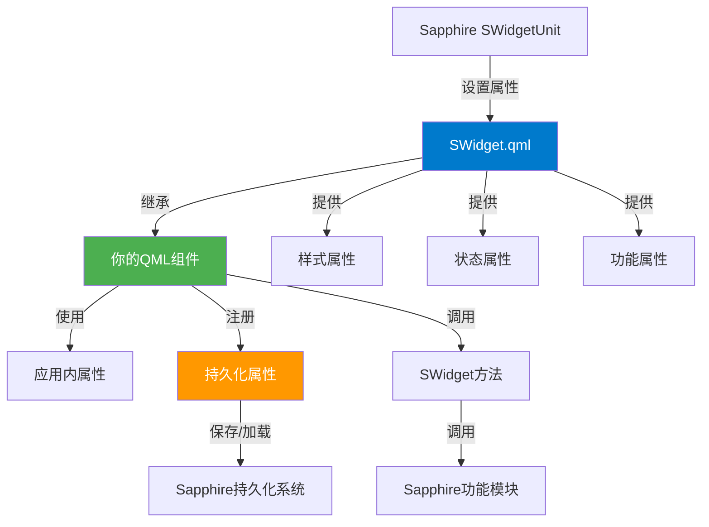
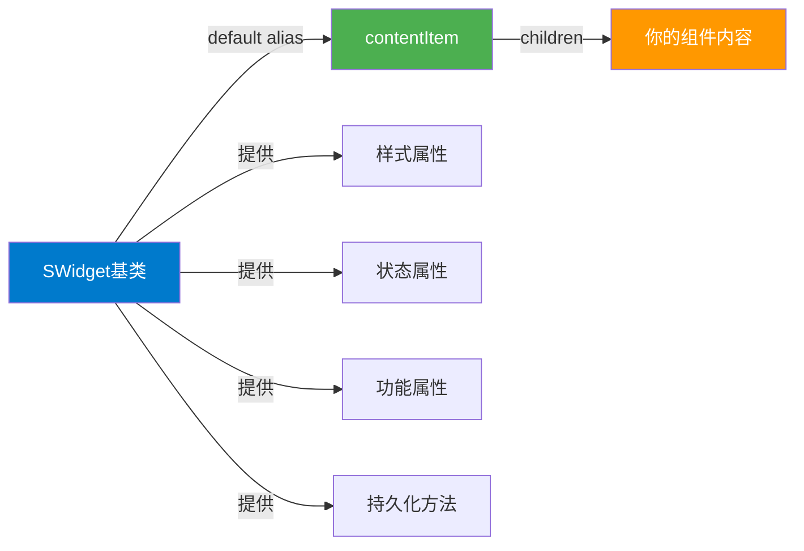
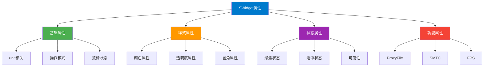
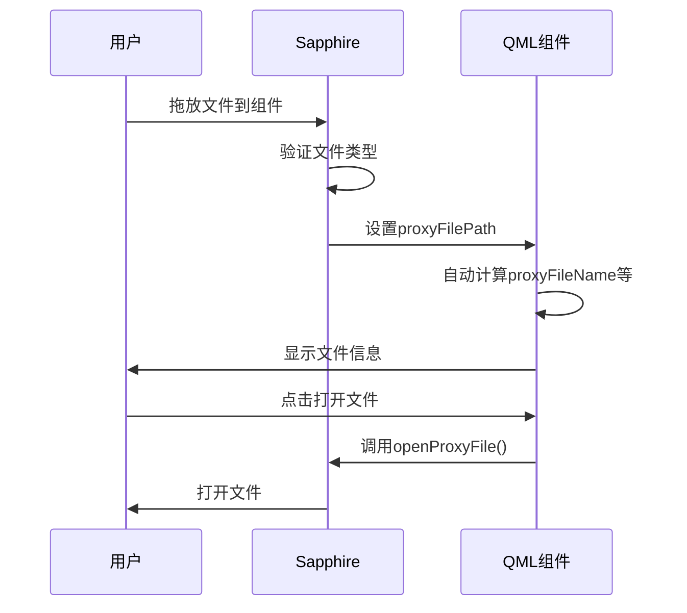
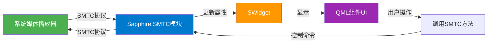
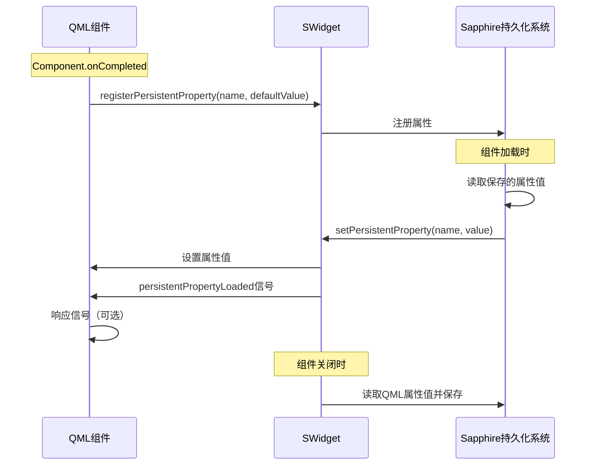

# QML组件开发文档

## 概述

QML组件是Sapphire桌面增强软件中的自定义小组件，使用Qt Quick/QML技术开发。本文档将指导你如何创建和开发QML组件。

### 属性管理说明

SWidget的属性根据来源和管理方式分为三类：

- **🔵 软件运行时自动接管**：由Sapphire在运行时自动设置和更新，开发者不应修改（在非软件运行时测试时可设置默认值）
- **🟡 通过元数据定义**：在 `metadata.json` 中定义，可通过小组件编辑器调整，Sapphire根据metadata自动设置
- **🟢 组件自行选择**：由组件开发者自行设置，Sapphire不会覆盖

文档中每个属性都会标注其类别。

### 架构概览



## 快速开始

### 0. 环境配置

1. **QML运行时环境**：QML与HTML相同，是解释性语言，在Sapphire中已经有运行时环境，无需额外编译
2. **开发环境推荐**：
   - 安装 Qt 6.8.3，在开发环境中导入 `SWidget.qml` 即可使用默认属性值进行开发测试
   - 或者直接在Sapphire中创建小组件实例，搭配热重载和软件内运行时、日志输出进行开发
3. **调试工具**：
   - 软件内调试面板：通过 `--log-console` 命令行参数，以开发者模式启动Sapphire
   - 编辑模式右键 → 开发者工具 → 调试面板
   - 可以使用 `console.log()` 输出调试信息

### 1. 创建新组件

1. 打开小组件编辑器（通过主菜单或快捷键）
2. 点击"创建新小组件"按钮
3. 选择"从模板创建" → 选择"QML模板"
4. 输入组件名称（name）和显示名称（displayName）
5. 点击确定，系统会自动创建新的QML组件项目

### 2. 编辑组件

创建完成后，组件会自动在编辑器中打开。编辑器支持QML语法高亮和自动补全：

- **主文件路径**：组件的主QML文件会自动设置为相对路径，无需额外配置
- **文件结构**：新组件会创建在 `resources/swidget/` 目录下，包含：
  - `metadata.json` - 组件元数据文件
  - `组件名.qml` - 主QML文件

### 3. 打开组件文件

在编辑器中点击"打开文件"按钮，会使用系统默认程序打开QML文件（通常是Qt Creator或VS Code）。

## 基本结构

### 继承SWidget

所有QML组件必须继承自 `common/SWidget.qml`：

```qml
import QtQuick 2.15
import QtQuick.Controls 2.15
import "../common"

SWidget {
    id: root
    
    // 你的组件内容
    Rectangle {
        anchors.fill: parent
        color: styleThemeColor
    }
}
```

### 组件结构图



⚠️ **重要注意事项**：由于SWidget设置了 `default property alias content: contentItem.children`，一些功能组件（如文件选择框、对话框等）**不可以**直接放置在根元素下，必须放在一个内部元素下（如Rectangle）：

```qml
SWidget {
    id: root
    
    // ❌ 错误：FileDialog不能直接放在根元素下
    FileDialog {
        id: fileDialog
        // ...
    }

    // ✅ 正确：放在内部Rectangle中
    Rectangle {
        anchors.fill: parent
        
        FileDialog {
            id: fileDialog
            // ...
        }
    }
}
```

### 导入路径

- 使用相对路径导入 `SWidget`：`import "../common"`
- 其他Qt模块使用标准导入：`import QtQuick 2.15`

## 应用内属性

SWidget提供了丰富的应用内属性。**重要说明**：根据属性的来源和管理方式，这些属性分为三类：

1. **🔵 软件运行时自动接管**：由Sapphire在运行时自动设置和更新，开发者不应修改（在非软件运行时测试时可设置默认值）
2. **🟡 通过元数据定义**：在 `metadata.json` 中定义，可通过小组件编辑器调整，Sapphire根据metadata自动设置
3. **🟢 组件自行选择**：由组件开发者自行设置，Sapphire不会覆盖

以下属性说明中会标注每个属性的类别。

### 属性分类总结表

| 属性类别 | 图标 | 说明 | 示例 |
|---------|------|------|------|
| **软件运行时自动接管** | 🔵 | 由Sapphire在运行时自动设置和更新，开发者不应修改（在非软件运行时测试时可设置默认值） | `unit`、`styleThemeColor`、`currentOperationMode`、`smtcMediaTitle` |
| **通过元数据定义** | 🟡 | 在 `metadata.json` 中定义，可通过小组件编辑器调整，Sapphire根据metadata自动设置 | `mouseEventMode`、`canProxyFile`、`smtcEnabled` |
| **组件自行选择** | 🟢 | 由组件开发者自行设置，Sapphire不会覆盖 | `globalRoundCornerEnabled`、`fpsDisplayMode` |

### 属性分类图



### 基础属性

#### 单元相关属性

```qml
// 🔵 软件运行时自动接管：SWidgetUnit实例，由Sapphire设置，用于访问Sapphire功能
property var unit: unitContext || null

// 🔵 软件运行时自动接管：单元主颜色（目前与styleThemeColor相同，保留用于兼容）
property color unitMainColor: "#007ACC"

// 🔵 软件运行时自动接管：单元状态属性
property bool unitIsFocus: false         // 是否聚焦（由Sapphire根据焦点状态自动更新）
property bool unitIsSelect: false         // 是否选中（由Sapphire根据选择状态自动更新）
property bool unitSimpleMode: false       // 是否简单模式（简化显示模式）
property int unitRadius: 8                // 圆角半径（像素）
// 🔵 软件运行时自动接管：是否启用圆角（由Sapphire根据单元状态设置）
property bool roundCornerEnabled: false
```

**使用说明**：

- `unit` 对象提供了访问Sapphire功能的接口，如 `unit.qmlModule`、`unit.smtcModule` 等
- `unitIsFocus` 和 `unitIsSelect` 会自动更新，可以用于响应式UI设计
- `unitRadius` 建议用于自定义圆角实现

⚠️ **重要**：这些属性在Sapphire运行时会被自动设置，开发者不应修改。

#### 样式颜色属性

```qml
// ========== 主题色相关 ==========
// 🔵 软件运行时自动接管：主题色（系统主题色或自定义主题色，推荐使用）
property color styleThemeColor: "#007ACC"
// 🔵 软件运行时自动接管：兼容旧属性名，建议使用styleThemeColor
property color currentThemeColor: styleThemeColor
// 🔵 软件运行时自动接管：背景色（由Sapphire根据样式设置）
property color styleBackgroundColor: "transparent"
// 🔵 软件运行时自动接管：文字色（由Sapphire根据样式设置，推荐用于文本显示）
property color styleTextColor: "#FFFFFF"
// 🔵 软件运行时自动接管：高亮色（由Sapphire根据样式设置，用于高亮显示）
property color styleHighlightColor: "#007ACC"

// ========== 聚焦相关颜色参数 ==========
// 🔵 软件运行时自动接管：这些属性用于控制聚焦时的视觉效果
property int styleUnfocusedAlpha: 100      // 未聚焦时的背景不透明度（0-255）
property int styleFocusedAlpha: 255        // 聚焦时的背景不透明度（0-255）
property real styleUnfocusedColorRatio: 0.5  // 未聚焦时的色值混合比率（0.0-1.0）
property real styleFocusedColorRatio: 1.0    // 聚焦时的色值混合比率（0.0-1.0）

// ========== 光效相关参数 ==========
// 🔵 软件运行时自动接管：光效参数
property int styleLightAlphaStart: 0    // 光效的起点不透明度（0-255）
property int styleLightAlphaEnd: 255    // 光效的终点不透明度（0-255）

// ========== 阴影相关参数 ==========
// 🔵 软件运行时自动接管：阴影参数
property int styleIconShadowAlpha: 100        // 图标阴影特效不透明度（0-255）
property int styleIconShadowBlurRadius: 10    // 图标阴影特效半径（1-100）

// ========== UI整体参数 ==========
// 🔵 软件运行时自动接管：UI整体参数
property int styleAcrylicMixStrength: 50  // 亚克力混合主题色强度（0-255）
property int styleUiOverallAlpha: 255      // UI整体不透明度（0-255）
```

**使用建议**：

- **优先使用 `styleThemeColor`**：这是软件内部的主题色，会根据用户配置自动调整
- **使用 `styleTextColor`**：确保文本在不同主题下都有良好的可读性
- **响应聚焦状态**：使用 `styleFocusedAlpha` 和 `styleUnfocusedAlpha` 实现聚焦高亮效果

⚠️ **重要**：这些属性在Sapphire运行时会被自动设置，开发者不应修改。

#### 操作模式属性

```qml
// 🔵 软件运行时自动接管：当前操作模式："desktop"（桌面模式）或"edit"（编辑模式）
property string currentOperationMode: "desktop"

// 🔵 软件运行时自动接管：单元可见性（更灵活的可见性控制）
// 当组件所在页面被隐藏时，此属性为false
// 建议：如果组件有高性能消耗（如持续播放视频），可以根据此属性暂停以节省性能
property bool unitVisible: true

// 🔵 软件运行时自动接管：组件数据路径（QML端只读）
// 可以使用QSettings自行读取和保存数据
property string widgetDataPath: ""

// 🟢 组件自行选择：全局圆角启用（内置的全局圆角蒙版）
// 若开启，会为组件内容套上完整的蒙版，限制内部元素
// 建议：关闭此选项，根据unitRadius自绘圆角以获得更好的性能和灵活性
property bool globalRoundCornerEnabled: true
```

⚠️ **重要注意事项**：

- `unitVisible` 可以用于性能优化：当组件不可见时暂停动画、视频播放等
- `widgetDataPath` 提供了独立的数据存储路径，可以使用 `QSettings` 进行数据持久化
- `globalRoundCornerEnabled` 会带来性能开销，建议关闭并自己实现圆角

#### 鼠标状态属性

```qml
/**
 * @brief 左键鼠标按下状态
 * 🔵 软件运行时自动接管：由Sapphire根据鼠标事件自动更新，QML端可以直接绑定使用
 * 注意：此属性不受mouseEventMode影响，始终反映实际的鼠标按下状态
 */
property bool leftMousePressed: false
```

**使用场景**：

- 用于实现按下效果（如按钮按下动画）
- 可以绑定到UI元素的透明度、缩放等属性

⚠️ **重要**：此属性在Sapphire运行时会被自动更新，开发者不应修改。

### ProxyFile属性（文件代理）

当组件支持文件代理时（在 `metadata.json` 中设置 `supportTypes.supportsFile: true`），可以使用以下属性：

```qml
// ========== 只读属性：代理文件路径 ==========
// 🔵 软件运行时自动接管：代理文件路径（QML端只读，不要修改）
property string proxyFilePath: ""

// ========== 计算属性：基于proxyFilePath自动计算 ==========
readonly property string proxyFileName: ""  // 文件名（自动从路径提取）
readonly property string proxyFileIcon: ""  // 文件图标（根据文件类型自动获取）
readonly property color proxyFileColor: styleThemeColor  // 文件颜色（根据文件类型自动获取）

// ========== 功能属性 ==========
// 🟡 通过元数据定义：是否支持文件代理（由Sapphire根据metadata.json中的supportTypes.supportsFile自动设置）
readonly property bool canProxyFile: false
// 🔵 软件运行时自动接管：是否显示拖拽overlay（由Sapphire根据拖拽状态自动控制）
property bool showDragOverlay: false
```

**文件代理流程图**：



⚠️ **注意事项**：

- `proxyFilePath` 是只读属性，不要尝试修改它
- `proxyFileName`、`proxyFileIcon`、`proxyFileColor` 是计算属性，会自动更新
- `canProxyFile` 由metadata中的 `supportTypes.supportsFile` 决定，可在小组件编辑器中调整
- 文件拖拽处理在Sapphire完成，QML端只需要响应 `showDragOverlay` 显示视觉反馈

### SMTC属性（系统媒体传输控制）

当组件启用SMTC功能时（在 `metadata.json` 中设置 `functions: ["SMTC"]`），可以使用以下属性：

```qml
// ========== SMTC基本状态 ==========
// 🟡 通过元数据定义：SMTC功能是否启用（由Sapphire根据metadata.json中的functions数组自动设置）
property bool smtcEnabled: false
// 🔵 软件运行时自动接管：当前可用的媒体会话数量
property int smtcSessionCount: 0
// 🔵 软件运行时自动接管：当前选中的会话ID
property string currentSMTCSessionId: ""
// 🔵 软件运行时自动接管：可用会话ID列表（数组）
property var smtcSessionIds: []

// ========== SMTC媒体信息 ==========
// 🔵 软件运行时自动接管：所有SMTC媒体信息属性由Sapphire自动更新
property string smtcMediaTitle: ""            // 媒体标题
property string smtcMediaArtist: ""           // 艺术家名称
property string smtcMediaAlbum: ""            // 专辑名称
property string smtcPlaybackStatus: ""        // 播放状态："Playing"、"Paused"、"Stopped"
property string smtcAppName: ""               // 媒体播放应用名称
property int smtcPlaybackProgress: 0          // 播放进度（0-100的百分比）
property int smtcPlaybackDuration: 0          // 总时长（毫秒）
property int smtcPlaybackPosition: 0          // 当前位置（毫秒）

// ========== SMTC控制能力 ==========
// 🔵 软件运行时自动接管：所有SMTC控制能力属性由Sapphire自动更新
property bool smtcHasAlbumArt: false          // 是否有专辑封面
property bool smtcCanPlay: false               // 是否可以播放
property bool smtcCanPause: false              // 是否可以暂停
property bool smtcCanStop: false               // 是否可以停止
property bool smtcCanSkipNext: false          // 是否可以下一首
property bool smtcCanSkipPrevious: false      // 是否可以上一首
property bool smtcCanSeek: false              // 是否可以跳转

// ========== SMTC详细信息字符串 ==========
// 🔵 软件运行时自动接管：SMTC详细信息字符串由Sapphire自动更新
property string smtcMediaInfo: ""             // 媒体信息字符串（格式化后的完整信息）
property string smtcControlCapabilities: ""   // 控制能力字符串（格式化后的能力列表）

// ========== SMTC缩略图（Base64编码，零拷贝优化）==========
// 🔵 软件运行时自动接管：SMTC缩略图由Sapphire自动更新
property string smtcAlbumArtBase64: ""         // Base64编码的JPEG图片数据
property string smtcAlbumArtSize: ""          // "width x height"格式的尺寸信息（如"200x200"）
```

**SMTC工作流程图**：



⚠️ **注意事项**：

- `smtcEnabled` 由metadata中的 `functions: ["SMTC"]` 决定，可在小组件编辑器中调整
- 所有SMTC属性都会自动更新，无需手动刷新
- `smtcAlbumArtBase64` 使用Base64编码，可以直接用于 `Image` 组件的 `source` 属性
- 控制操作前应检查对应的 `smtcCan*` 属性，确保操作可用

### FPS计数属性

```qml
// ========== FPS数据 ==========
// 🔵 软件运行时自动接管：FPS数据由Sapphire自动更新
property real currentFps: 0.0              // 当前FPS（实时更新）
property real lastSecondFps: 0.0           // 上一秒FPS
property real tenSecondAverageFps: 0.0     // 十秒平均FPS

// ========== FPS显示模式枚举 ==========
enum FpsDisplayMode {
    Always = 0,   // 常显（开发调试时使用）
    Hover = 1,    // 鼠标悬停时显示（性能监控）
    Never = 2     // 从不显示（生产环境推荐）
}

// 🟢 组件自行选择：FPS显示模式（默认Never，不显示）
property int fpsDisplayMode: SWidget.FpsDisplayMode.Never
```

**使用建议**：

- 开发时设置为 `Always` 监控性能
- 生产环境设置为 `Never` 避免影响用户体验
- `tenSecondAverageFps` 更适合用于性能分析

⚠️ **重要**：`currentFps`、`lastSecondFps`、`tenSecondAverageFps` 由Sapphire自动更新，开发者不应修改。`fpsDisplayMode` 由组件自行设置。

## 持久化属性

持久化属性允许组件保存和恢复用户设置，这些属性会在组件关闭时自动保存，重新打开时自动加载。

### 持久化属性流程图



### 注册持久化属性

在 `Component.onCompleted` 中注册需要持久化的属性：

```qml
SWidget {
    id: root
    
    // 定义持久化属性（必须声明为property）
    property string mySetting: "default value"
    property int myNumber: 100
    property bool myFlag: true
    property var myData: {"key": "value"}
    property list<string> myList: ["item1", "item2"]
    
    Component.onCompleted: {
        // 注册持久化属性（名称必须与property名称一致）
        registerPersistentProperty("mySetting", "default value")
        registerPersistentProperty("myNumber", 100)
        registerPersistentProperty("myFlag", true)
        registerPersistentProperty("myData", {"key": "value"})
        registerPersistentProperty("myList", ["item1", "item2"])
    }
}
```

⚠️ **重要注意事项**：

1. **必须在 `Component.onCompleted` 中注册**：其他时机注册可能无效
2. **属性名必须一致**：注册时的名称必须与property名称完全一致
3. **默认值类型必须匹配**：注册时的默认值类型必须与property类型匹配
4. **支持的类型**：`string`、`int`、`bool`、`var`（包括对象和数组）、`list<string>` 理论上支持所有property类型，但是为了防止意外情况请尽量使用基本类型

### 属性加载回调（Signal）

SWidget提供了 `persistentPropertyLoaded` 信号，当属性被加载时会触发：

```qml
SWidget {
    id: root
    
    property string mySetting: "default"
    
    Component.onCompleted: {
        registerPersistentProperty("mySetting", "default")
    }
    
    // 连接信号处理属性加载
    Connections {
        target: root
        function onPersistentPropertyLoaded(name, value) {
            if (name === "mySetting") {
                // 自定义验证或转换逻辑
                if (value.length > 10) {
                    mySetting = value.substring(0, 10)
                    console.log("属性值过长，已截断")
                } else {
                    mySetting = value
                }
            }
        }
    }
}
```

或者使用信号处理器：

```qml
SWidget {
    id: root
    
    property string mySetting: "default"
    
    Component.onCompleted: {
        registerPersistentProperty("mySetting", "default")
    }
    
    // 信号处理器（当属性被加载时自动调用）
    onPersistentPropertyLoaded: function(name, value) {
        if (name === "mySetting") {
            // 自定义处理逻辑
            mySetting = value
        }
    }
}
```

### 持久化属性最佳实践

```qml
SWidget {
    id: root
    
    // ✅ 好的实践：属性有明确的默认值
    property string userName: "User"
    property int fontSize: 16
    property bool darkMode: false
    
    // ✅ 好的实践：复杂数据使用var类型
    property var settings: {
        "theme": "light",
        "language": "zh-CN"
    }
    
    Component.onCompleted: {
        // ✅ 好的实践：按逻辑顺序注册
        registerPersistentProperty("userName", "User")
        registerPersistentProperty("fontSize", 16)
        registerPersistentProperty("darkMode", false)
        registerPersistentProperty("settings", {"theme": "light", "language": "zh-CN"})
    }
    
    // ✅ 好的实践：验证加载的数据
    onPersistentPropertyLoaded: function(name, value) {
        if (name === "fontSize") {
            // 确保字体大小在合理范围内
            if (value < 8 || value > 72) {
                fontSize = 16
                console.warn("字体大小超出范围，已重置为默认值")
            }
        }
    }
}
```

## 事件处理控制

### 鼠标事件接收模式

通过 `mouseEventMode` 属性控制组件在什么情况下接收鼠标事件：

```qml
// ========== 鼠标事件接收模式枚举 ==========
enum MouseEventMode {
    Always = 0,        // 全部 - 始终接收鼠标事件
    OnlyEdit = 1,      // 仅编辑模式 - 仅在编辑模式下接收鼠标事件
    OnlyNonEdit = 2,   // 仅非编辑模式 - 仅在非编辑模式下接收鼠标事件（默认）
    Never = 3          // 从不 - 从不接收鼠标事件
}

// 🟡 通过元数据定义：鼠标事件接收模式（由Sapphire根据metadata.json中的mouseEventMode设置）
// 可在小组件编辑器的"高级选项"中调整
property int mouseEventMode: SWidget.MouseEventMode.OnlyNonEdit

// ========== 计算属性：根据模式和当前操作模式判断是否应该接收鼠标事件 ==========
// 注意：这里的鼠标事件是"传输到QML内部"的事件
// 对于应用内默认事件，如leftMousePressed、unitIsFocus不受影响
property bool shouldAcceptMouseEvents: true
```

### 使用示例

```qml
SWidget {
    id: root
    
    // 设置为"仅非编辑模式"（默认）
    // 这意味着在桌面模式下可以接收鼠标事件，编辑模式下不接收
    mouseEventMode: SWidget.MouseEventMode.OnlyNonEdit
    
    // 使用shouldAcceptMouseEvents判断是否应该接收事件
    MouseArea {
        anchors.fill: parent
        enabled: shouldAcceptMouseEvents
        onClicked: {
            console.log("点击了组件")
        }
    }
}
```

### 鼠标事件模式说明

| 模式 | 值 | 说明 | 适用场景 |
|------|-----|------|----------|
| **Always** | 0 | 始终接收鼠标事件，无论当前是桌面模式还是编辑模式 | 需要在编辑模式下也能交互的组件 |
| **OnlyEdit** | 1 | 仅在编辑模式下接收鼠标事件 | 编辑工具类组件 |
| **OnlyNonEdit** | 2 | 仅在非编辑模式下接收鼠标事件（默认） | **大多数交互组件**（推荐） |
| **Never** | 3 | 从不接收鼠标事件 | 纯展示组件（如时钟、天气显示） |

⚠️ **重要说明**：

- `mouseEventMode` 由metadata中的 `mouseEventMode` 字段决定，可在小组件编辑器的"高级选项"中调整
- `mouseEventMode` 控制的是"传输到QML内部"的鼠标事件
- `leftMousePressed`、`unitIsFocus` 等应用内默认事件**不受** `mouseEventMode` 影响
- 大多数交互组件应使用 `OnlyNonEdit`（默认值）
- 纯展示组件可以使用 `Never` 避免不必要的鼠标事件处理

## 方法

### 持久化属性方法

```qml
/**
 * @brief 注册持久化属性（仅在Component.onCompleted时调用）
 * @param name 属性名（必须与property名称一致）
 * @param defaultValue 默认值（类型必须与property类型匹配）
 */
function registerPersistentProperty(name, defaultValue)

/**
 * @brief 设置持久化属性值（由Sapphire调用，通常不需要手动调用）
 * @param name 属性名
 * @param value 属性值
 */
function setPersistentProperty(name, value)
```

### ProxyFile方法

```qml
/**
 * @brief 打开代理文件
 * 使用系统默认程序打开代理文件
 */
function openProxyFile()

/**
 * @brief 打开代理文件所在位置
 * 在文件管理器中打开代理文件所在的文件夹
 */
function openProxyFileLocation()
```

**ProxyFile信号**：

```qml
/**
 * @brief 代理文件被删除事件（由Sapphire触发）
 * 注意：proxyFilePath由Sapphire自动清除，QML端不需要操作
 */
signal proxyFileRemoved()

/**
 * @brief 代理文件被重命名事件（由Sapphire触发）
 * @param oldPath 旧文件路径
 * @param newPath 新文件路径
 * 注意：proxyFilePath由Sapphire自动更新，proxyFileName等计算属性会自动更新
 */
signal proxyFileRenamed(string oldPath, string newPath)
```

**使用示例**：

```qml
SWidget {
    id: root
    
    // 响应文件删除事件
    onProxyFileRemoved: {
        console.log("代理文件已被删除")
        // 清理相关UI状态
    }
    
    // 响应文件重命名事件
    onProxyFileRenamed: function(oldPath, newPath) {
        console.log("文件重命名:", oldPath, "->", newPath)
        // 可选更新相关逻辑（绑定属性会自动更新）
    }
}
```

### SMTC方法

```qml
/**
 * @brief 设置当前SMTC会话
 * @param sessionId 会话ID（从smtcSessionIds数组中获取）
 */
function setSMTCSession(sessionId)

/**
 * @brief 播放媒体
 * @return 是否成功（bool）
 */
function playSMTCMedia() -> bool

/**
 * @brief 暂停媒体
 * @return 是否成功（bool）
 */
function pauseSMTCMedia() -> bool

/**
 * @brief 停止媒体
 * @return 是否成功（bool）
 */
function stopSMTCMedia() -> bool

/**
 * @brief 下一首
 * @return 是否成功（bool）
 */
function skipSMTCNext() -> bool

/**
 * @brief 上一首
 * @return 是否成功（bool）
 */
function skipSMTCPrevious() -> bool

/**
 * @brief 跳转到指定位置
 * @param position 位置（0-100的百分比）
 * @return 是否成功（bool）
 */
function seekSMTCToPosition(position) -> bool
```

⚠️ **注意事项**：

- 所有SMTC方法都会返回 `bool` 值表示操作是否成功
- 操作前应检查对应的 `smtcCan*` 属性，确保操作可用
- `setSMTCSession` 用于切换不同的媒体会话（如多个播放器同时运行）

### 拖拽事件方法

```qml
/**
 * @brief 拖拽进入时调用（由Sapphire调用）
 * 显示拖拽overlay
 */
function onDragEnter()

/**
 * @brief 拖拽离开时调用（由Sapphire调用）
 * 隐藏拖拽overlay
 */
function onDragLeave()
```

⚠️ **注意事项**：

- 这两个方法由Sapphire自动调用，通常不需要手动调用

## 完整示例

### 基础示例

```qml
import QtQuick 2.15
import QtQuick.Controls 2.15
import "../common"

SWidget {
    id: root
    
    // 禁用全局圆角裁切（建议自己实现圆角以获得更好的性能）
    globalRoundCornerEnabled: false
    
    // FPS显示模式（生产环境设置为Never）
    fpsDisplayMode: SWidget.FpsDisplayMode.Never
    
    // 持久化属性
    property string userName: "User"
    property int fontSize: 16
    
    // 内容区域
    Rectangle {
        anchors.fill: parent
        color: styleBackgroundColor
        radius: unitRadius  // 使用unitRadius实现圆角
        
        Column {
            anchors.centerIn: parent
            spacing: 10
            
            Text {
                text: "Hello, " + userName
                font.pixelSize: fontSize
                color: styleTextColor  // 使用样式文字色
            }
            
            Text {
                text: "Theme Color: " + styleThemeColor
                color: styleThemeColor  // 使用主题色
            }
        }
    }
    
    Component.onCompleted: {
        // 注册持久化属性
        registerPersistentProperty("userName", "User")
        registerPersistentProperty("fontSize", 16)
    }
}
```

### SMTC媒体控制示例

```qml
import QtQuick 2.15
import QtQuick.Controls 2.15
import "../common"

SWidget {
    id: root
    
    Column {
        anchors.centerIn: parent
        spacing: 10
        
        // 媒体信息
        Text {
            text: smtcMediaTitle || "无媒体"
            color: styleTextColor
            font.pixelSize: 16
        }
        
        Text {
            text: smtcMediaArtist || ""
            color: styleTextColor
            font.pixelSize: 12
        }
        
        // 专辑封面（如果有）
        Image {
            width: 100
            height: 100
            source: smtcAlbumArtBase64 ? "data:image/jpeg;base64," + smtcAlbumArtBase64 : ""
            visible: smtcHasAlbumArt
        }
        
        // 播放控制按钮
        Row {
            spacing: 5
            
            Button {
                text: "⏮"
                enabled: smtcCanSkipPrevious
                onClicked: {
                    if (skipSMTCPrevious()) {
                        console.log("上一首成功")
                    }
                }
            }
            
            Button {
                text: smtcPlaybackStatus === "Playing" ? "⏸" : "▶"
                enabled: smtcCanPlay || smtcCanPause
                onClicked: {
                    if (smtcPlaybackStatus === "Playing") {
                        pauseSMTCMedia()
                    } else {
                        playSMTCMedia()
                    }
                }
            }
            
            Button {
                text: "⏭"
                enabled: smtcCanSkipNext
                onClicked: skipSMTCNext()
            }
        }
        
        // 进度条
        ProgressBar {
            width: 200
            value: smtcPlaybackProgress / 100.0
            enabled: smtcCanSeek
            
            // 点击进度条跳转
            MouseArea {
                anchors.fill: parent
                onClicked: {
                    if (smtcCanSeek && smtcPlaybackDuration > 0) {
                        var percent = mouseX / width * 100
                        seekSMTCToPosition(Math.max(0, Math.min(100, percent)))
                    }
                }
            }
        }
        
        // 时间显示
        Text {
            text: formatTime(smtcPlaybackPosition) + " / " + formatTime(smtcPlaybackDuration)
            color: styleTextColor
            font.pixelSize: 10
        }
    }
    
    // 格式化时间（毫秒转分:秒）
    function formatTime(ms) {
        if (ms <= 0) return "0:00"
        var seconds = Math.floor(ms / 1000)
        var minutes = Math.floor(seconds / 60)
        seconds = seconds % 60
        return minutes + ":" + (seconds < 10 ? "0" : "") + seconds
    }
}
```

### 文件代理示例

```qml
import QtQuick 2.15
import QtQuick.Controls 2.15
import "../common"

SWidget {
    id: root
    
    // 禁用全局圆角裁切（建议自己实现圆角）
    globalRoundCornerEnabled: false
    fpsDisplayMode: SWidget.FpsDisplayMode.Never
    
    Rectangle {
        anchors.fill: parent
        color: styleBackgroundColor
        radius: unitRadius
        
        Column {
            anchors.centerIn: parent
            spacing: 10
            
            // 文件图标（如果有）
            Image {
                width: 80
                height: 80
                source: proxyFileIcon && proxyFileIcon !== "" ? proxyFileIcon : ""
                fillMode: Image.PreserveAspectFit
                visible: proxyFilePath !== ""
                
                // 占位图标
                Text {
                    anchors.centerIn: parent
                    text: "📄"
                    font.pixelSize: 48
                    visible: !parent.source || parent.source === ""
                }
            }
            
            // 显示代理文件信息
            Text {
                text: proxyFileName || "拖放文件到这里"
                color: styleTextColor
                font.pixelSize: 16
                horizontalAlignment: Text.AlignHCenter
            }
            
            // 文件路径（可选显示）
            Text {
                text: proxyFilePath || ""
                color: styleTextColor
                font.pixelSize: 10
                opacity: 0.7
                visible: proxyFilePath !== ""
                horizontalAlignment: Text.AlignHCenter
                elide: Text.ElideMiddle
                width: 200
            }
            
            // 操作按钮
            Row {
                spacing: 8
                anchors.horizontalCenter: parent.horizontalCenter
                
                Button {
                    text: "打开文件"
                    enabled: proxyFilePath !== ""
                    onClicked: openProxyFile()
                }
                
                Button {
                    text: "打开位置"
                    enabled: proxyFilePath !== ""
                    onClicked: openProxyFileLocation()
                }
            }
        }
    }
    
    // 响应文件删除事件（信号处理器）
    onProxyFileRemoved: {
        console.log("代理文件已被删除")
        // 可以在这里清理相关UI状态
    }
    
    // 响应文件重命名事件（信号处理器）
    onProxyFileRenamed: function(oldPath, newPath) {
        console.log("文件重命名:", oldPath, "->", newPath)
        // 可以在这里更新UI显示
    }
    
    // 拖拽overlay会自动显示（由Sapphire控制showDragOverlay）
}
```

## 最佳实践

### 1. 组件结构

✅ **推荐做法**：

```qml
SWidget {
    id: root
    
    // 1. 首先设置配置属性
    globalRoundCornerEnabled: false
    fpsDisplayMode: SWidget.FpsDisplayMode.Never
    
    // 2. 定义持久化属性
    property string mySetting: "default"
    
    // 3. 定义内部属性
    property int internalCounter: 0
    
    // 4. 主要内容区域
    Rectangle {
        // ...
    }
    
    // 5. 在Component.onCompleted中注册持久化属性
    Component.onCompleted: {
        registerPersistentProperty("mySetting", "default")
    }
}
```

### 2. 性能优化

✅ **推荐做法**：

- 禁用不需要的功能：`globalRoundCornerEnabled: false`
- 自己实现圆角：使用 `radius: unitRadius` 而不是全局圆角
- 响应 `unitVisible`：当组件不可见时暂停动画、视频等
- 生产环境关闭FPS显示：`fpsDisplayMode: SWidget.FpsDisplayMode.Never`

### 3. 样式使用

✅ **推荐做法**：

- 使用 `styleThemeColor` 而不是硬编码颜色
- 使用 `styleTextColor` 确保文本可读性
- 响应聚焦状态：使用 `styleFocusedAlpha` 和 `styleUnfocusedAlpha`

### 4. 持久化属性

✅ **推荐做法**：

- 在 `Component.onCompleted` 中注册所有持久化属性
- 为属性提供合理的默认值
- 在 `onPersistentPropertyLoaded` 中验证数据有效性
- 使用有意义的属性名称

### 5. 错误处理

✅ **推荐做法**：

```qml
// 检查unit对象是否存在
if (unit && unit.qmlModule) {
    unit.qmlModule.someMethod()
} else {
    console.warn("unit或qmlModule不可用")
}

// 检查SMTC功能是否启用
if (smtcEnabled && smtcCanPlay) {
    playSMTCMedia()
} else {
    console.warn("SMTC功能不可用或无法播放")
}
```

## 常见问题

### Q: 如何访问Sapphire的unit对象？

A: 通过 `unit` 属性访问，例如：

```qml
if (unit && unit.qmlModule) {
    unit.qmlModule.someMethod()
}
```

⚠️ **注意**：使用前必须检查 `unit` 是否存在，因为它在组件初始化时可能为 `null`。

### Q: 持久化属性支持哪些类型？

A: 支持 `string`、`int`、`bool`、`var`（包括对象和数组）、`list<string>`。

⚠️ **注意**：复杂对象建议使用 `var` 类型，数组建议使用 `list<string>` 或 `var`。

### Q: 如何判断组件是否在编辑模式？

A: 使用 `currentOperationMode === "edit"` 判断。

```qml
if (currentOperationMode === "edit") {
    // 编辑模式下的逻辑
} else {
    // 桌面模式下的逻辑
}
```

### Q: 如何自定义圆角？

A: 设置 `globalRoundCornerEnabled: false`，然后在自己的Rectangle中使用 `radius: unitRadius`。

```qml
SWidget {
    globalRoundCornerEnabled: false
    
    Rectangle {
        anchors.fill: parent
        radius: unitRadius  // 使用unitRadius
        color: styleBackgroundColor
    }
}
```

### Q: 如何启用SMTC功能？

A: 在 `metadata.json` 中设置 `functions: ["SMTC"]`，然后组件会自动获得SMTC相关属性。

⚠️ **注意**：需要重新加载组件才能生效。

### Q: 如何支持文件拖放？

A: 在 `metadata.json` 中设置 `supportTypes.supportsFile: true`，然后组件会自动获得文件代理相关属性和方法。

### Q: 为什么FileDialog不能直接放在SWidget根元素下？

A: 因为SWidget设置了 `default property alias content: contentItem.children`，某些功能组件（如FileDialog、MessageBox等）不能作为默认子元素。解决方法是将它们放在一个内部元素（如Rectangle）中。

### Q: persistentPropertyLoaded和onPersistentPropertyLoaded有什么区别？

A:

- `persistentPropertyLoaded` 是**信号**（signal），由Sapphire触发
- `onPersistentPropertyLoaded` 是**信号处理器**（signal handler），当信号触发时自动调用

两者功能相同，可以使用任意一种方式：

```qml
// 方式1：使用信号处理器（推荐）
onPersistentPropertyLoaded: function(name, value) {
    // 处理逻辑
}

// 方式2：使用Connections
Connections {
    target: root
    function onPersistentPropertyLoaded(name, value) {
        // 处理逻辑
    }
}
```

### Q: 如何调试QML组件？

A:

1. 使用 `console.log()` 输出调试信息
2. 使用 `--log-console` 启动参数查看控制台输出
3. 在编辑模式下右键 → 开发者工具 → 调试面板
4. 开发时设置 `fpsDisplayMode: SWidget.FpsDisplayMode.Always` 监控性能

## 注意事项总结

⚠️ **关键注意事项**：

1. **属性分类理解**：
   - 🔵 **软件运行时自动接管**的属性在Sapphire运行时会被自动设置，开发者不应修改
   - 🟡 **通过元数据定义**的属性可在小组件编辑器中调整，修改后需要重新加载组件
   - 🟢 **组件自行选择**的属性由开发者自行设置，Sapphire不会覆盖

2. **default alias限制**：FileDialog等组件不能直接放在SWidget根元素下

3. **持久化属性注册时机**：必须在 `Component.onCompleted` 中注册

4. **属性名一致性**：注册时的名称必须与property名称完全一致

5. **只读属性**：🔵类属性（如`proxyFilePath`、`unit`等）和🟡类属性（如`smtcEnabled`、`canProxyFile`等）是只读的，不要尝试修改

6. **性能优化**：建议关闭 `globalRoundCornerEnabled`（🟢类属性），自己实现圆角

7. **鼠标事件模式**：🟡类属性，可在小组件编辑器中调整，大多数组件使用默认值 `OnlyNonEdit` 即可

8. **unit对象检查**：使用 `unit`（🔵类属性）前必须检查是否存在

9. **SMTC操作检查**：操作前检查对应的 `smtcCan*` 属性（🔵类属性，自动更新）

10. **响应unitVisible**：高性能组件应根据 `unitVisible`（🔵类属性）暂停操作

11. **生产环境配置**：生产环境应设置 `fpsDisplayMode: Never`（🟢类属性）

## 相关文档

- [SWidget.qml源码参考](../common/SWidget.qml)
- [组件元数据规范](metadata.md)（待补充）
- [Qt QML官方文档](https://doc.qt.io/qt-6/qtqml-index.html)
