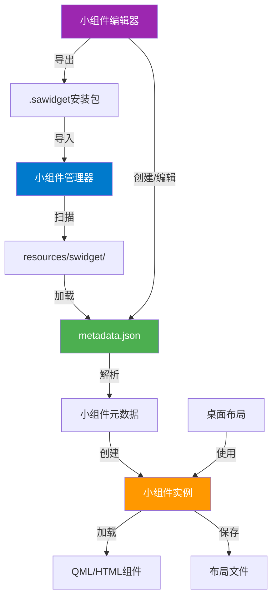
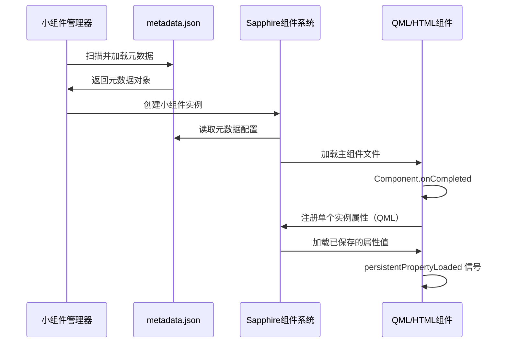

# 小组件系统开发文档

## 概述

本文档介绍 Sapphire 小组件系统的基本概念、数据结构和开发流程，作为 QML/HTML 组件开发的前置知识。本文档不涉及 C++ 实现细节，专注于开发者需要了解的系统概念和数据结构。

### 系统架构概览



## 小组件类型

Sapphire 支持三种类型的小组件：

| 类型 | 说明 | 主文件 | 适用场景 |
|------|------|--------|----------|
| **QML** | Qt Quick/QML 组件 | `.qml` 文件 | 高性能、软件兼容更好、复杂交互、较丰富的系统功能 |
| **HTML** | HTML/JavaScript 组件 | `.html` 文件 | Web 技术栈、快速开发、跨平台兼容、动效实现容易 |
| **URL** | 网页 URL 组件 | URL 字符串 | 直接嵌入网页、在线内容展示 |

### 类型选择建议

- **QML**：推荐用于需要高性能、复杂动画、系统集成的组件
- **HTML**：推荐用于 Web 开发者、快速原型、已有 Web 项目
- **URL**：推荐用于直接展示在线内容、无需本地文件

⚠️ **重要**：Sapphire 提供的Web引擎在大范围动态渲染上表现不佳

## 文件结构

### 标准目录结构

每个小组件项目都位于 `resources/swidget/` 目录下，采用以下标准结构：

```text
WidgetFolder/
├─ metadata.json          (必需：元数据文件)
├─ widget.qml/html        (必需：主组件文件，根据类型不同)
├─ manual.md              (可选：使用手册)
└─ preview.png            (可选：预览图)
```

### 文件说明

#### metadata.json（必需）

小组件的元数据文件，包含所有配置信息。详见 [元数据结构](#元数据结构) 章节。

#### widget.qml / widget.html（必需）

- **QML 类型**：主 QML 文件，必须继承 `common/SWidget.qml`
- **HTML 类型**：主 HTML 文件，通过 `SWebWidget.qml` 包装加载
- **URL 类型**：无需此文件，直接在 `metadata.json` 中指定 URL

#### manual.md（可选）

使用手册文件，Markdown 格式。可在小组件编辑器中查看。

#### preview.png（可选）

预览图文件，用于在小组件列表和编辑器中显示。建议尺寸：300x200 像素。

## 元数据结构

### metadata.json 格式

`metadata.json` 是小组件的核心配置文件，采用 JSON 格式。完整结构如下：

```json
{
  "name": "my_widget",
  "displayName": "我的小组件",
  "description": "这是一个示例小组件",
  "version": "1.0.0",
  "author": "作者名称",
  "authorEmail": "author@example.com",
  "authorWebsite": "https://example.com",
  "tags": ["工具", "天气", "时钟"],
  "widgetType": "Qml",
  "widgetFileName": "widget.qml",
  "manualFileName": "manual.md",
  "previewImageFileName": "preview.png",
  "supportTypes": {
    "supportsImage": false,
    "supportsFile": false,
    "supportsVideo": false
  },
  "mouseEventMode": 2,
  "functions": ["SMTC"],
  "defaultGridSize": {
    "rows": 2,
    "cols": 2
  },
  "defaultShowBackground": true,
  "permissions": ["network", "file"],
  "minimumAppVersion": "1.0.0",
  "customFields": {}
}
```

### 字段说明

#### 基本信息

| 字段 | 类型 | 必需 | 说明 |
|------|------|------|------|
| `name` | string | ✅ | 小组件唯一标识符（英文、数字、下划线、连字符、点号，不能以数字开头） |
| `displayName` | string | ✅ | 显示名称（可包含中文，用于 UI 显示） |
| `description` | string | ❌ | 小组件描述 |
| `version` | string | ❌ | 版本号（如 "1.0.0"），默认 "1.0.0" |
| `author` | string | ❌ | 作者名称 |
| `authorEmail` | string | ❌ | 作者邮箱 |
| `authorWebsite` | string | ❌ | 作者网站 URL |
| `tags` | array | ❌ | 标签列表（字符串数组） |

#### 组件类型和文件

| 字段 | 类型 | 必需 | 说明 |
|------|------|------|------|
| `widgetType` | string | ✅ | 组件类型："Qml"、"Html"、"Url" |
| `widgetFileName` | string | ✅ | 主文件名（Qml/Html 类型）或 URL（Url 类型） |
| `manualFileName` | string | ❌ | 使用手册文件名 |
| `previewImageFileName` | string | ❌ | 预览图文件名 |

#### 功能特性

| 字段 | 类型 | 必需 | 说明 |
|------|------|------|------|
| `supportTypes` | object | ❌ | 支持的内容类型（见下表） |
| `mouseEventMode` | int | ❌ | 鼠标事件接收模式（见下表），默认 2 |
| `functions` | array | ❌ | 可选功能列表（如 ["SMTC"]） |

**supportTypes 对象**：

```json
{
  "supportsImage": false,  // 是否支持图片拖放
  "supportsFile": false,   // 是否支持文件拖放（启用 ProxyFile 功能）
  "supportsVideo": false   // 是否支持视频拖放
}
```

**mouseEventMode 枚举值**：

| 值 | 模式 | 说明 |
|----|------|------|
| 0 | Always | 始终接收鼠标事件 |
| 1 | OnlyEdit | 仅在编辑模式下接收 |
| 2 | OnlyNonEdit | 仅在非编辑模式下接收（默认） |
| 3 | Never | 从不接收鼠标事件 |

**functions 支持的功能**：

- `"SMTC"`：系统媒体传输控制，允许组件访问和控制系统的媒体播放

#### 尺寸和布局

| 字段 | 类型 | 必需 | 说明 |
|------|------|------|------|
| `defaultGridSize` | object | ❌ | 默认网格大小（见下表），默认 1x1 |
| `defaultShowBackground` | bool | ❌ | 是否默认启用原生背景方框，默认 false |

**defaultGridSize 对象**：

```json
{
  "rows": 2,  // 行数（1-10）
  "cols": 2   // 列数（1-10）
}
```

#### 权限和安全

| 字段 | 类型 | 必需 | 说明 |
|------|------|------|------|
| `permissions` | array | ❌ | 需要的权限列表（字符串数组，如 ["network", "file"]） |
| `minimumAppVersion` | string | ❌ | 最低支持的应用版本（如 "1.0.0"） |

#### 扩展字段

| 字段 | 类型 | 必需 | 说明 |
|------|------|------|------|
| `customFields` | object | ❌ | 自定义字段，用于未来扩展 |

## 存储结构

### 小组件文件存储

所有小组件项目存储在 `resources/swidget/` 目录下，每个小组件拥有独立的文件夹：

```text
resources/swidget/
├─ widget_name_1/
│  ├─ metadata.json
│  ├─ widget.qml
│  └─ ...
├─ widget_name_2/
│  ├─ metadata.json
│  ├─ widget.html
│  └─ ...
└─ ...
```

### 单个实例属性存储

**单个实例属性**（原"持久化属性"）是每个小组件实例的独立配置数据，保存在布局文件中对应的组件配置下。

- **QML 组件**：提供原生支持，通过 `registerPersistentProperty` 注册，Sapphire 自动保存到布局文件
- **HTML 组件**：暂不支持原生单个实例属性

**数据格式**：

```json
{
  "propertyName1": "value1",
  "propertyName2": 100,
  "propertyName3": true,
  "propertyName4": ["item1", "item2"],
  "propertyName5": {
    "key": "value"
  }
}
```

### 自定义数据存储

如果需要保存**自定义数据**（文件、配置等），请使用 `widgetDataPath` 提供的路径：

- **QML 组件**：通过 `widgetDataPath` 属性获取路径（上下文属性）
- **HTML 组件**：通过 `bridge.getWidgetDataPath()` 方法获取路径

**路径说明**：

- `widgetDataPath` 指向每个小组件实例的专属数据目录
- 格式：`data/widget/小组件名称/实例ID/`
- 建议在此路径下保存自定义文件、配置等数据

```qml
// QML 示例：使用 widgetDataPath 保存自定义数据
import Qt.labs.settings 1.0

// 方式1：使用 QSettings 保存到 widgetDataPath
Settings {
    id: settings
    fileName: widgetDataPath + "config.ini"  // 指定保存路径
    property string mySetting: "default"
}

// 方式2：使用 FileIO 或其他方式保存自定义文件
// 文件路径：widgetDataPath + "my_data.json"
```

```javascript
// HTML 示例：使用 widgetDataPath 保存自定义数据
// 获取数据路径（可用于标识或日志记录）
const dataPath = bridge.getWidgetDataPath();

// 使用 Web 存储 API 保存数据
// 方式1：localStorage（小量数据）
localStorage.setItem('mySetting', 'value');

// 方式2：IndexedDB（大量结构化数据）
// 注意：实际文件保存需要通过 bridge 提供的其他方法或使用 Web 存储 API
```

## 小组件编辑器

小组件编辑器是创建、编辑和管理小组件的可视化工具。

### 主要功能

- **创建新小组件**：从模板、文件或 URL 创建
- **编辑元数据**：基本信息、功能特性、尺寸布局等
- **文件管理**：打开主文件、选择手册和预览图、打开目录
- **导入导出**：导出为 `.sawidget` 安装包，或从安装包导入
- **桌面集成**：添加到桌面、删除小组件

### 创建方式

1. **从模板创建**：选择 QML/HTML 模板，输入名称，系统自动创建项目
2. **从文件创建**：选择现有的 `.qml` 或 `.html` 文件，系统复制并创建元数据
3. **从 URL 创建**：输入网页 URL，系统创建项目并将 URL 存储在元数据中

### 编辑流程

在小组件列表中选择组件 → 编辑元数据字段 → 实时预览 JSON → 保存更改

## 导入导出

小组件可以导出为 `.sawidget` 安装包（包含所有项目文件），也可以从安装包导入。

- **导出**：在编辑器中打开小组件 → 点击"导出" → 选择保存路径
- **导入**：点击"导入.sawidget小组件" → 选择安装包 → 自动安装到 `resources/swidget/`

## 小组件生命周期

### 加载流程



### 运行时流程

1. **初始化阶段**：
   - 加载 `metadata.json`
   - Sapphire 组件系统创建小组件实例
   - 加载主组件文件（QML/HTML）
   - 设置上下文属性

2. **注册阶段**（仅 QML）：
   - QML 组件在 `Component.onCompleted` 中注册单个实例属性
   - Sapphire 从布局文件加载已保存的属性值
   - 触发 `persistentPropertyLoaded` 信号

3. **运行阶段**：
   - 组件正常运行，响应用户交互
   - Sapphire 自动更新样式属性、状态属性等
   - 组件可以调用 Sapphire 提供的功能方法

4. **保存阶段**（仅 QML）：
   - 组件关闭时，Sapphire 自动读取单个实例属性值
   - 保存到布局文件中对应的组件配置

## 热重载机制

开发时，Sapphire 自动监视小组件主文件变化，保存后延迟 500ms 自动重载。QML 组件的单个实例属性会自动保存和恢复。

## 命名规范

### 小组件名称（name）

- 只能包含：大小写字母、数字、下划线、连字符、点号
- 不能以数字开头
- 必须唯一
- 示例：✅ `my_widget`、`weather-display`、`clock.v2` | ❌ `123widget`、`my widget`

### 文件命名

- 主文件：建议 `widget.qml` 或 `widget.html`
- 元数据：必须 `metadata.json`
- 手册：建议 `manual.md`
- 预览图：建议 `preview.png`

## 最佳实践

- **元数据配置**：完整填写基本信息，合理设置标签和功能特性
- **文件组织**：保持目录整洁，使用相对路径，提供预览图
- **版本管理**：使用语义化版本（如 `1.0.0`），及时更新版本号

## 常见问题

**Q: 如何修改小组件名称？**  
A: 在编辑器中修改 `name` 字段（开发者模式），保存即可。

**Q: 如何备份小组件？**  
A: 使用"导出"功能导出为 `.sawidget` 安装包。

**Q: 单个实例属性存储在哪里？**  
A: 保存在布局文件中对应的组件配置下。全局属性：QML 使用 `QSettings`，HTML 使用 `localStorage` 或 `cookies`。

**Q: 如何调试小组件？**  
A: 使用 `console.log()` + `--log-console` 参数，或编辑模式下右键 → 开发者工具 → 调试面板。

## 相关文档

- [QML组件开发文档](QML.md) - QML 组件的详细开发指南
- [HTML组件开发文档](HTML.md) - HTML 组件的详细开发指南（待补充）
- [SWidget.qml源码参考](../common/SWidget.qml) - SWidget 基类源码
